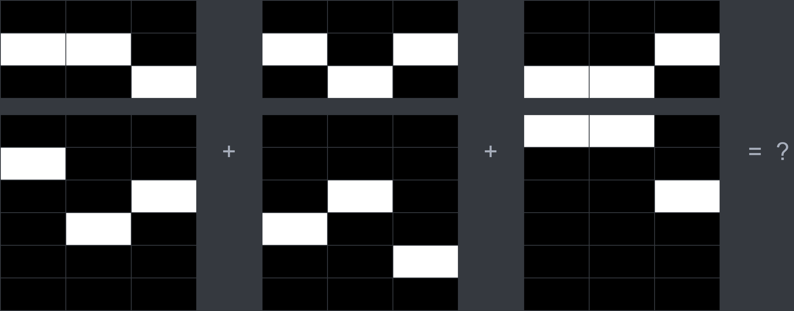

# Calculator

> 

*本关已给提示：珠。*

## 解析

一开始很多人都猜上半部分三进制，下半部分六进制，但是试了好多种解释方式之后就会发现，都不对。

所以在起初的时候这关的通关人数廖廖无几，但是给了提示之后 10 分钟内就有 8 位玩家做出来了，可见这一个字的信息量之大。

没错，这关就是象形的算盘（老式 calculator）！我们可以根据图形中的算珠分析出对应的数字来，它们分别是 682, 829, 7，加起来就是 1518，填进去就对了！

（据反馈，有的玩家在解谜的时候想到了算盘的可能性，但“感觉不是”就换思路了，提示公布之后才意识到。所以说一定要敢于尝试啊！不敢尝试的话那么 [Art](./art.md) 那关也过不了。）
