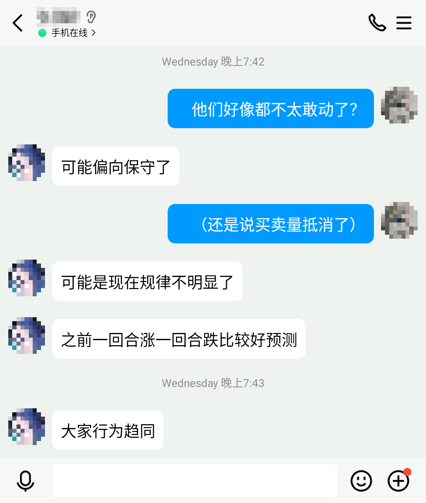

# Capitalist


本题的部分数据/状态由所有玩家共享


> 每分钟为一个回合。当玩家停留在该页面时，他每分钟可以获得1个单位的商品（只有一种商品）。
>
> 有一个中央市场，可以按照一定的价格收购或销售商品。市场价会随着全体用户的购买/出售行为而发生变化。总体的规律是，如果市场的收购量多于销售量，那么下一回合的价格会走低；如果销售量多于收购量，那么下一回合的价格会走高。
>
> 你完全有可能通过大量买入来哄抬价格，然后紧接着卖出同样多的商品，赚取差价。不过……你并不知道其它玩家的行为，而且他们的买卖操作也会影响市场价格。你可以看到从开始时间为止的全部市场价格变化图表。

## 解析

既然大额交易会导致大幅亏损，那么玩家就必须在“靠金钱通关”和“靠商品通关”这两个思路中进行选择。在这两个思路之间不停跳变是完全不可取的。如果要靠商品通关的话，思路就应该是要么“仅生产”，要么少量低买高卖，总之别亏商品数量；如果要靠金钱通关的话，那就应该多卖出，尤其是在市场价格高的时候多卖。

市场价 0.625 是一个关键节点，因为对于通关来说，25 金钱和 40 商品是等价的。如果市场价远高于 0.625，那么把商品都换成钱就要更赚；如果远低于 0.625，那么把钱都换成商品就更赚。

对于前期玩家来说，市场价是 1.2，这个时候大家很容易陷入到“全部换钱”的思维陷阱中。但是如果玩家有研究过这个规则的话就会发现：所有玩家都只能生产商品而没有人可以生产金钱！也就是说，在交易过程中，不可避免地会产生这样的现象：大家都在生产商品，然后卖出；但没有人可以生产金钱，所以市场价的下跌趋势是必然的结果！

当然这是长期趋势。对于很多玩家来说，短期的赚差价还是更重要一些；所以但凡参与交易，肯定会在高价时卖出而低价时买入。这样就会形成一涨一跌的局面，大家就会找到规律，这关也就没什么意思了。所以我本人出马，开始凭借大量初始资源，通过大额买入/卖出来操纵市场！

不过总体来说，这关不太可能卡关，大家用或长或短的时间都可以过。而且这次解谜的战线拖得挺长，差几分钟到十几分钟也不是什么大问题。
