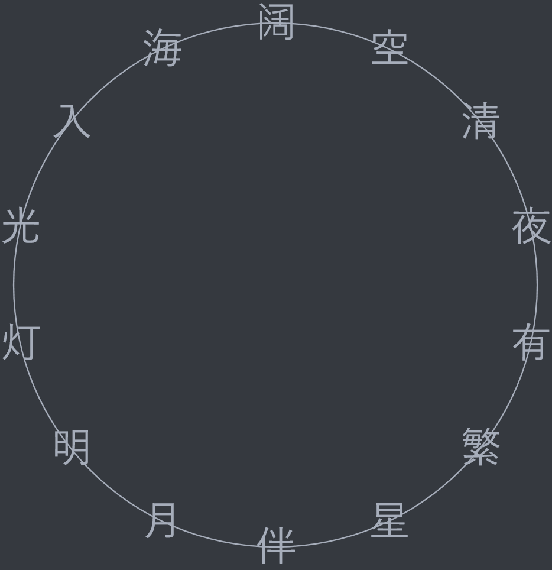

# Palindrome

> 

## 解析

（我本来以为本关会有点难度的——就算不难，起码也会拖点时间；但是没想到大家解决的速度有点快于我的预期了。后来一问才知道，大家是直接对照模板来填词的，根本没考虑那么多……）

Palindrome 是回文的意思。所以想必很多玩家都在研究怎么用回文，然后会发现无论怎么回文，写出来的诗都极不通顺，不像正常的诗（当然也不会通关）。（甚至有个大神在这关卡了快一天，最终错失奖金）

百度一下“回文诗”（第一名当时的做法是搜“圆形十四个字诗歌”，也可），然后很快就会发现这些东西……

这不就是和本题的图很像吗？所以有的人看懂了这类解法之后就直接照着模板填然后过关了！

（其实我就应该把这个圆圈转一转，因为预期当中读者应该要学点诗词格律常识才能做出这题的……）

绝句的基本格律要求是：四句一绝，二、四两句必须押韵，第三句不押韵，第一句可押韵或不押韵。如果读者知道这个，应该先找韵脚，然后再绕圈推演整首诗。这才是预期解法。

如果你懂的更多，还可以按照绝句的平仄格律来分析，它属于“平平仄仄仄平平”（平起首句入韵）式。当然，本题不需要这么深的知识；有则更好。

至于用韵的标准……很幸运，这道题的诗既可以用平水韵解，又可以用新韵解，这两种标准都是没问题的。

（至于诗本身……我水平不怎么样，想了半年也想不出一首更好的，只能写到看起来不尬的境界，各位多多包涵……）

答案为：

> 阔空清夜有繁星，夜有繁星伴月明。
> 伴月明灯光入海，灯光入海阔空清。
