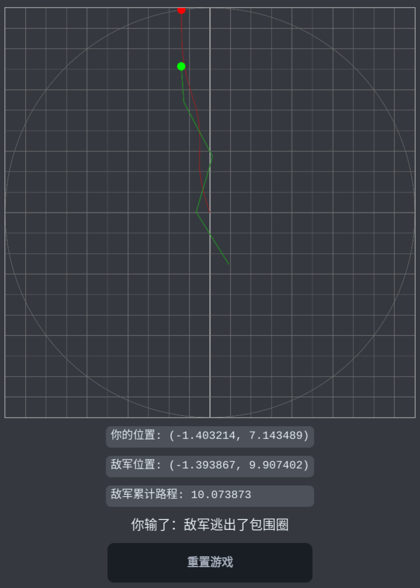
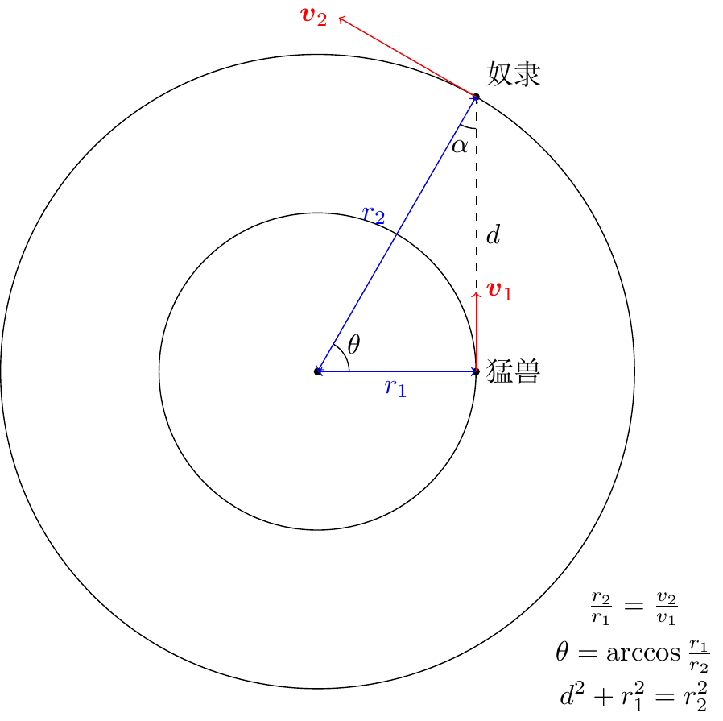
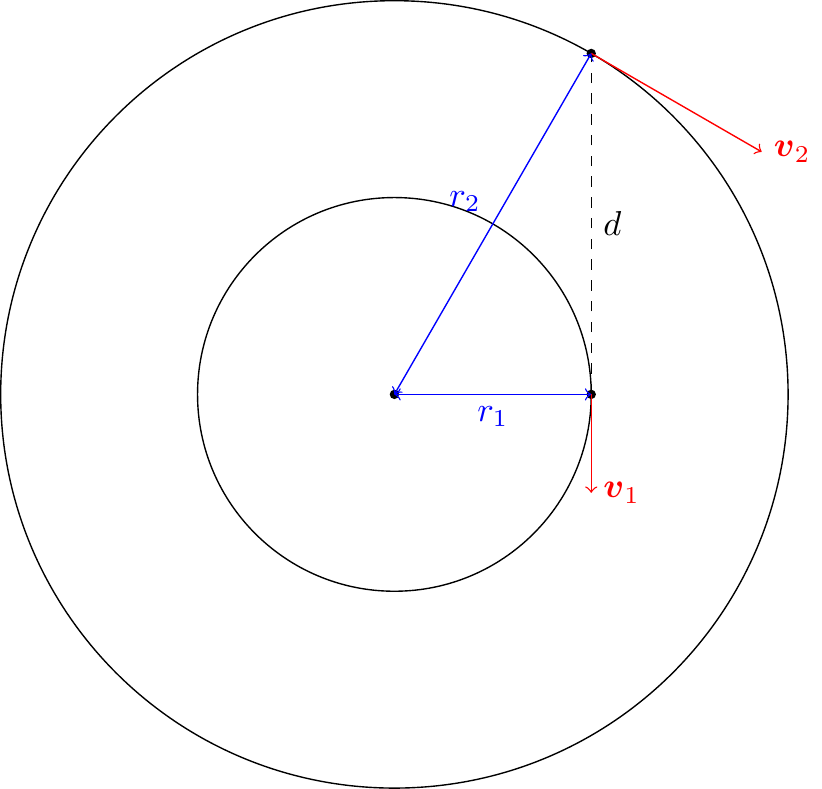
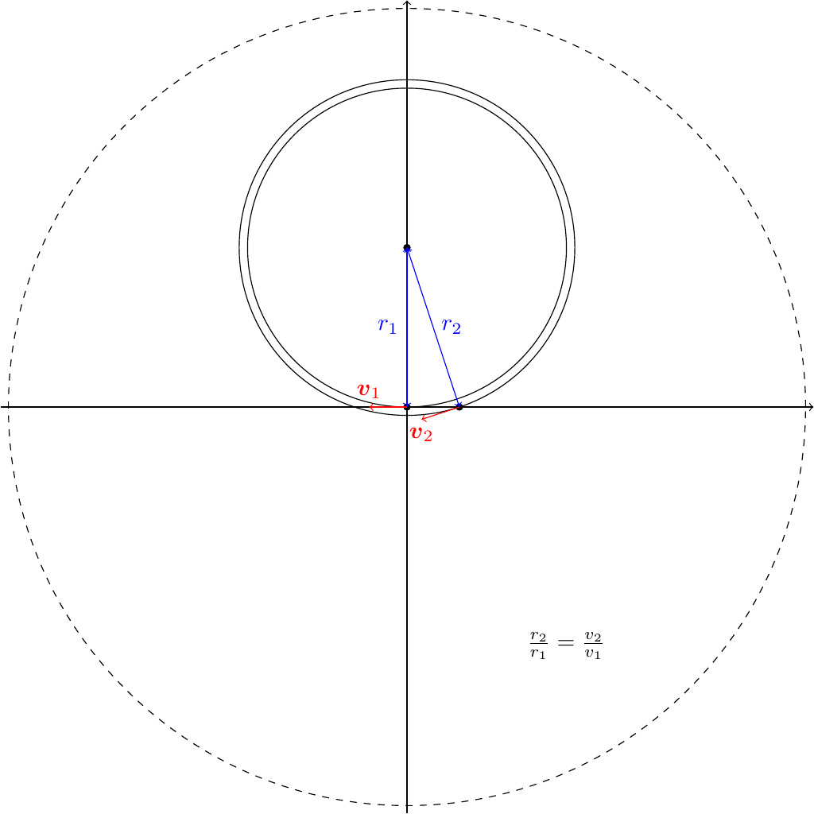

# BesiegeWithoutAssault

> 在平面直角坐标系中，敌军的初始位置是 $$(0,0)$$，你可以选择任意一个位置，向敌军发动突袭。
>
> 突袭开始后，敌军总是朝着远离你的方向移动（此运动过程通过 300 步的近似连续过程来模拟），你可以指定任意位置进行移动。你与敌军的速度之比为 $$1:0.95$$。
>
> 你需要做到「围而不攻」，既不能过分靠近敌军（距离 $$d\le1$$），又不能让敌军逃出包围圈（$$x^2+y^2\le10^2$$）的范围。
>
> 当敌军累计走过的路线长度达到 $$95$$ 时，你的任务完成。
>
> 

## 解析

这个问题乍看起来还挺难想的，因为范围不大，而且双方的速度相差无几，所以一不小心就会让敌军逃出包围圈，追都追不上。

一开始我把这题的速度比设计成 $$1:0.5$$，但是测题时发现太简单，乱走都能过；所以经过反复测试，最后我选定了 $$1:0.95$$ 的速度，这样就不能乱走了，必须仔细思考对策才行。

实际上，这道题的思路源自于一个“你追我逃”的模型。我们不妨做此假设：

### 原始问题

> 在一个圆形斗兽场内，一个奴隶和一头猛兽正在相互追逐。奴隶的速度比猛兽要快（假设速度比是 $$\frac{v_2}{v_1}$$，但他不能逃出斗兽场的范围；而猛兽总是朝着奴隶的方向进行追逐。
>
> 斗兽场的大小可以足够大，但并不是无限大的。问：是否有一种逃跑方案可以使猛兽永远也追不上奴隶？

解决这个问题的方案如下图所示，只要按照图示的位置关系跑成一个圆，猛兽就永远也追不上奴隶。

### “稳定状态”

我们先来证明这个状态是稳定的。只要这个状态是稳定的，那么猛兽就永远追不上奴隶，二者只会在各自的轨道上无限画圆。

因为 $$\frac{r_2}{r_1}=\frac{v_2}{v_1}$$，所以二者的角速度 $$\omega_1=\omega_2$$。那么经过一小段时间 $$\Delta t$$ 之后，二者关于圆心的夹角 $$\theta$$ 仍然保持不变。换句话说，在运动轨道上，奴隶仍然保持比猛兽超前 $$\theta$$ 角度的位置关系。

而在这段时间内 $$r_1$$ 是不会发生变化的，因为猛兽的速度方向刚好垂直于运动半径。

既然 $$r_2,\,r_1,\,\theta$$ 都不变，那么我们就会发现一个事实：由 $$r_1,\,r_2,\,d$$ 三边构成的三角形可以始终保持不变，二者就会永远这样运动下去。**这就是我所说的稳定状态。**

### 引入变因

接下来我们假设奴隶的运动方向略微偏离了原轨道，那样会发生什么呢？

如果奴隶的运动方向向外偏，那么**运动半径 $$r_2$$ 就会增大。又因为线速度不变，所以奴隶的角速度将会变小。这样一来，**$$\theta$$ 也会变小**。

而奴隶速度向外偏，会使得运动速度在 $$d$$ 方向上的分量增大，拉开二者的距离，所以**$$d$$ 会变大**。

问题来了：$$\alpha$$ 和 $$r_1$$ 会如何变化？以下给出四种假说：

- $$\alpha$$ 增大或不变，$$r_1$$ 减小或不变。这种情况是根本不可能发生的，因为在邻边 $$r_2$$ 和 $$d$$ 都增大的情况下，$$\alpha$$ 增大或不变就必然意味着对边 $$r_1$$ 减小。
- $$\alpha$$ 减小，$$r_1$$ 减小或不变。这种情况也不可能发生，因为 $$\theta$$ 和 $$\alpha$$ 都减小就意味着另一个内角增大，而这个内角增大就意味着猛兽的运动方向会外偏，这样是不可能推导出 $$r_1$$ 减小或不变的结论的。
- $$\alpha$$ 增大或不变，$$r_1$$ 增大。这种情况是可能的，不会产生任何矛盾。
- $$\alpha$$ 减小，$$r_1$$ 增大。这种情况也是可能的，不会产生任何矛盾。

$$\alpha$$ 会怎么变化，我们暂时不能下定论，但是**$$r_1$$ 增大是必然的**。而 $$r_1$$ 增大就意味着，**猛兽的运动方向也会外偏**。

同样的道理，我们可以得出，如果奴隶的运动方向内偏，那么猛兽的运动方向也将内偏。

但是无论如何偏转，只要奴隶以一个新的圆心、新的半径开始做圆周运动，那么猛兽的运动方向当然也就会趋近于半径比等于线速度比的同心圆。

### 把思路逆转过来

说了这么多，这个问题和本关之间到底有什么联系呢？

你可以尝试把整个运动过程逆转过来：不是猛兽追奴隶，而是奴隶追猛兽；猛兽不是朝着奴隶跑，而是背对着奴隶，朝着远离他的方向跑。那么整个问题就会变成：

至于奴隶还是野兽，我军还是敌军，换个名字的事情而已。

不知读者有没有发现，在这里，“围而不打”的要义**不一定是追得越近越好，也不是一定非要朝着他的方向追，而是保持在一个稳定状态，和对手一直这样耗下去**。如果一上来就思考这个“围而不打”的问题，我们恐怕很难得出这么清晰的结论。

### 稳态的初始化

问题到这里还没有结束。我们的斗兽场，或者说包围圈，只是一个很小的范围。我们真的能做到把敌军控制在这么小的范围之内吗？不妨试试。

我们的初始选点是随意的，但不能离敌军太近，也就是 $$d>1$$ 才行。

有了 $$d$$ 之后我们还需要确定圆周运动的圆心。因为 $$\frac{r_2}{r_1}=\frac{v_2}{v_1}$$，且 $$d^2+r_1^2=r_2^2$$，所以我们很容易算出 $$r_1=\frac{dv_1}{\sqrt{v_2^2-v_1^2}}$$。

如果我们选点 $$(d,0)$$ 的话，那么圆周运动的圆心就是 $$(0,r_1)$$（$$(0,-r_1)$$ 亦可），这样一来，只要满足 $$2r_1\le10$$，我们就可以确保敌军总是在包围圈内运动，如图所示：

我自己做题的时候希望这个半径不要太大，又不要太小，所以设定在 $$r_1=4$$ 左右是比较合适的，那么对应的 $$d$$ 就是 $$1.2$$ 左右。

不过实际做起来我们没办法走曲线，那就只能用较短的直线来逼近曲线上的一段弧。这样做肯定也会带来精度损失，所以我们需要频繁调整我们的方向，争取把敌军控制在包围圈内。下图是我自己走的效果，在这里敌军总计走过的路程达到了 260，将近三个 95。

