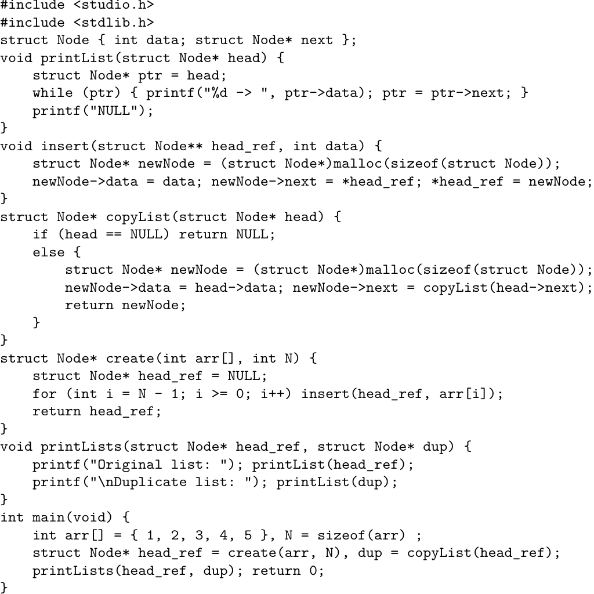
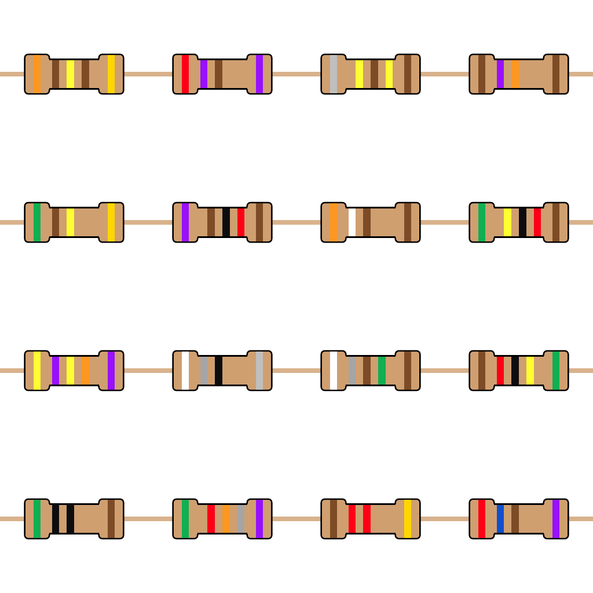
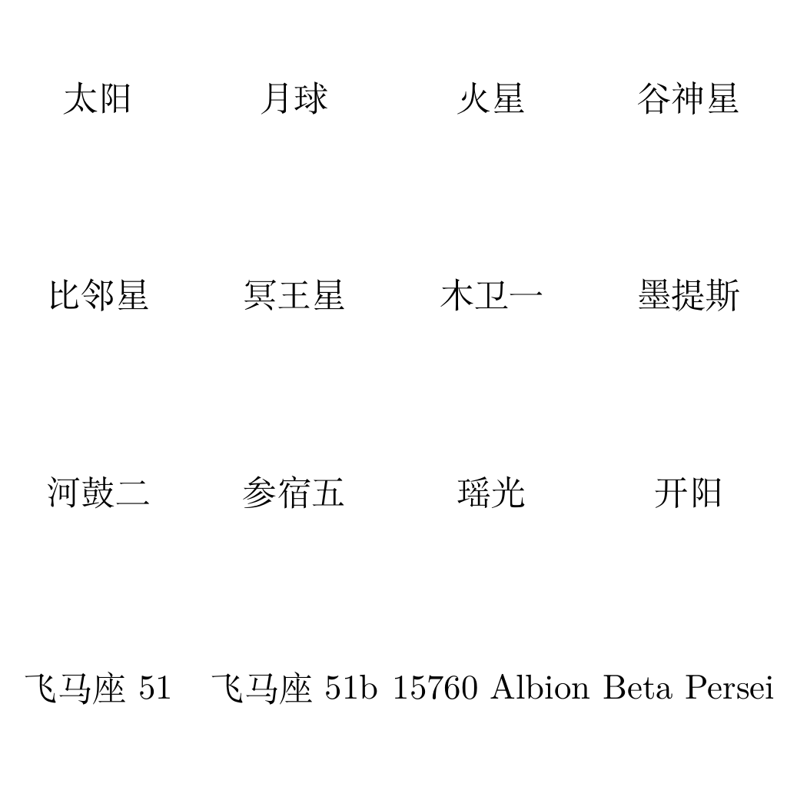
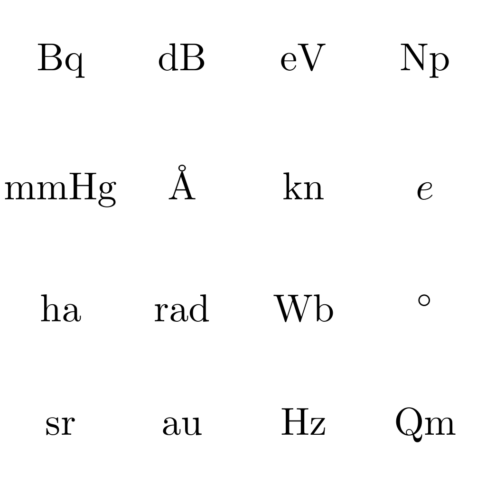
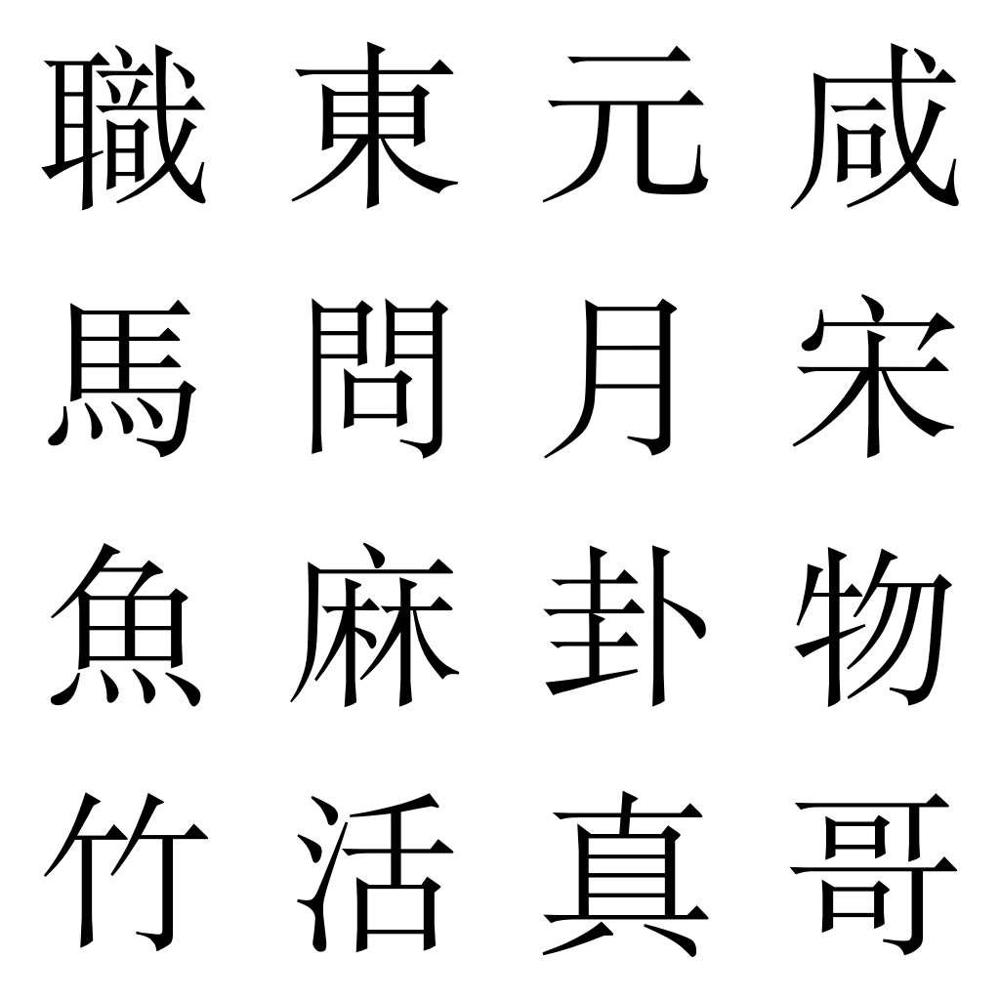
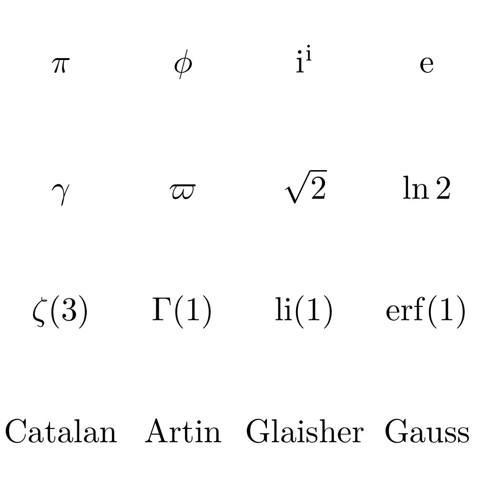
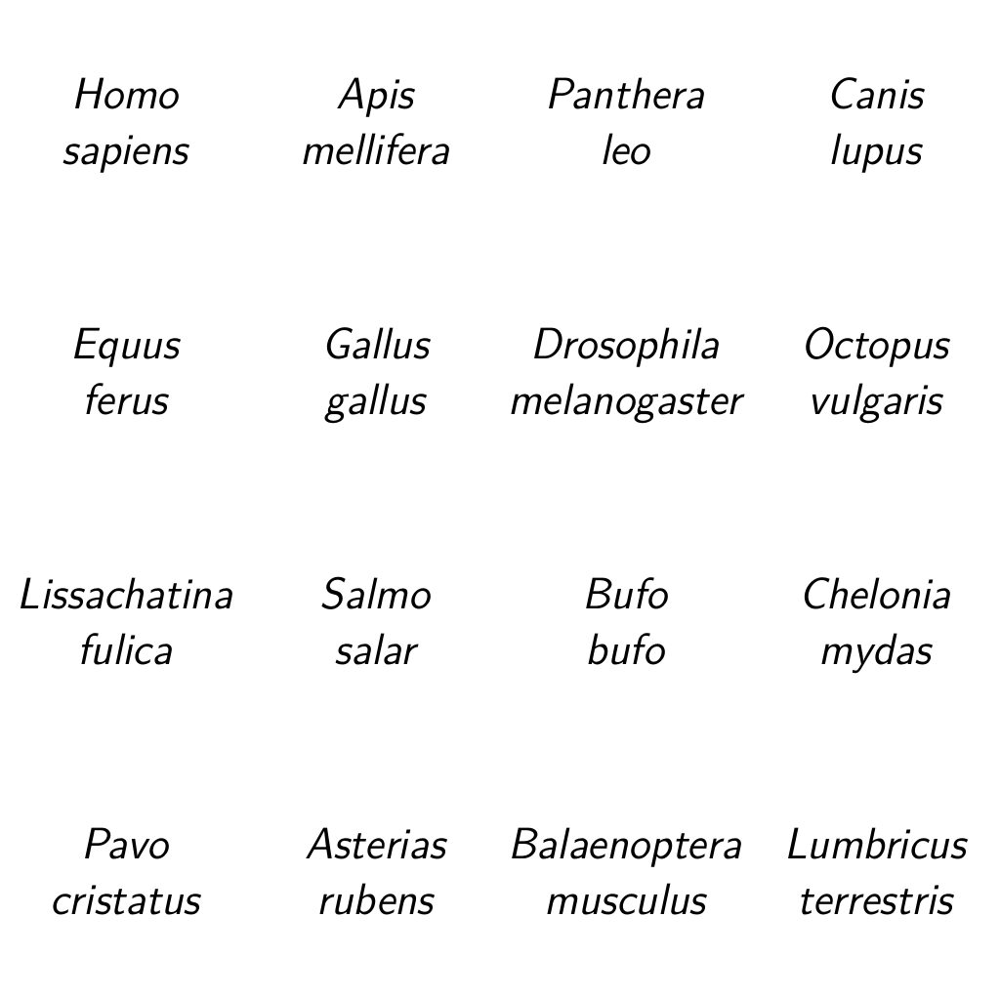

# CAPTCHA

本关是一道模拟验证码的题目，要求玩家在给定的 16 个图片中选出符合要求的内容。

但是，由我出的验证码怎么会像普通验证码那样简单呢……

可选题目一共有 7 个，接下来我将逐题解析：

## bug

> 请选出以下包含 **bug** 的所有图片：
>
> 

错误共有五处：

- 头文件 `studio.h` 错误，应为 `stdio.h`；
- `struct Node` 定义时，`next` 之后未加分号；
- `create` 函数中，`for` 循环迭代操作不是 `i++` 而是 `i--`（这是唯一一个不能靠编译器检查出来的错）；
- `create` 函数中，调用 `insert` 函数时应当传入 `struct Node**` 类型的参数，所以要用 `&head_ref`；
- `main` 函数中，`struct Node* head_ref, dup;` 这样定义的 `dup` 其实是 `struct Node` 类型。若要正确定义，应写作 `*dup`。

## resistor

> 请选出以下包含 **$$1.2\mathrm{k\Omega}$$ 电阻** 的所有图片：
>
> 

这道题要用[色环电阻法](https://en.wikipedia.org/wiki/Electronic_color_code#Resistors)读出每个电阻的阻值。

注意，不是每个电阻都要从左向右读数！读数的起始位置取决于中间的色环离哪一侧更近。比如说，第 1 行第 3 列的色环离右侧近，所以从右向左读出 $$141\times10^4\pm10\%$$。

| 第一列 | 第二列 | 第三列 | 第四列 |
| --- | --- | --- | --- |
| $$314\times10^1\pm5\%$$ | $$27\times10^1\pm0.1\%$$ | $$141\times10^4\pm10\%$$ | $$17\times10^3\pm1\%$$ |
| $$51\times10^4\pm0.5\%$$ | **$$120\times10^1\pm0.1\%$$** | $39\times10^1\pm1\%$$ | $$120\times10^4\pm0.5\%$$ |
| $$474\times10^3\pm0.1\%$$ | $$98\pm10\%$$ | $$981\times10^5\pm1%$$ | $$120\times10^4\pm0.5\%$$ |
| $$50\pm1\%$$ | $$783\times10^2\pm0.5\%$$ | **$$12\times10^2\pm5\%$$** | $$26\times10^1\pm0.1\%$$ |

## planet

> 请选出以下包含 **行星** 的所有图片：
>
> 

这道题的坑点在于，除了人们熟知的太阳系八大行星以外，还有“系外行星”这回事。

- [ ] 太阳当然是恒星。
- [ ] 月球当然是卫星。
- [x] 火星当然是行星。
- [ ] 谷神星可能要查一下。其实它只是太阳系内的一个“小行星”。（“小行星”和“行星”是完全不同的）
- [ ] 比邻星是离太阳系最近的**恒星**。
- [ ] 冥王星在过去被人们普遍认为是行星，但早在 2006 年它就被划为**矮行星**了。（矮行星也不是行星）
- [ ] 木卫一，顾名思义，就是木星的卫星。
- [ ] 墨提斯是木卫十六的别名，当然也是卫星。
- [ ] 河鼓二、参宿五、瑶光、开阳，这些古人就能看得见的系外天体当然不可能是（不发光的）行星，一般来说都是恒星。至于系外行星，那都是 19 世纪之后才开始发现的。
- [ ] 飞马座 51 是飞马座的一个恒星。
- [x] 飞马座 51b 是属于飞马座 51 的天体，它是不是行星呢？查一下会发现它确实是一个系外行星。
- [ ] 15760 Albion 是一个介于海王星和冥王星之间的海王星外天体。（既然它是在太阳系内的，那我们直接照八大行星的名单排除就行了）
- [ ] Beta Persei 也就是英仙座β，是一个由恒星构成的多星系统。

## unit

> 请选出以下包含 **长度单位** 的所有图片：
>
> 

这题也算是有点坑，一个是微观度量，一个是天文度量，还有一个很年轻的新单位，网上资料不多。

- [ ] Bq（贝克勒）是放射性活度单位。
- [ ] dB（分贝）是比例单位，在声学、电子学等领域都有涉及。
- [ ] eV（电子伏特）是能量单位。
- [ ] Np（奈培）是和 dB 相似的比例单位。
- [ ] mmHg（毫米汞柱）是压强单位。
- [x] Å（埃斯特朗）是长度单位，一般用于微观长度的计量，$$1Å=10^{-10}\mathrm m$$。
- [ ] kn（节）是速度单位，一般用于航海、航空。
- [ ] ha（公顷）是面积单位。
- [ ] rad 有两种可能的解读，一说是弧度单位，一说是辐射吸收剂量单位。但不管怎么说，都不是长度单位。
- [ ] Wb（韦伯）是磁通量单位。
- [ ] ◦（度）是角度单位。
- [ ] sr（球面度）是立体角的单位。
- [x] au（天文单位）是长度单位。起初人们把日地之间的距离定义为 1au。
- [ ] Hz（赫兹）是频率单位。
- [x] Qm（昆米）是长度单位。这里的 Q 表示 $$10^{30}$$，是 2022 年启用的新词头。

## tone

> 请选出以下包含 **入声字** 的所有图片：
>
> 

这题没有任何坑，上网找本《广韵》自己查一遍就好了。

当然，如果你有相关的方言基础，这题甚至可以不用查资料，读一遍就过了。

**答案：職、月、物、竹、活**

## math

> 请选出以下包含 **大于2的数学常数** 的所有图片：
>
> 

这道题没什么坑，当然前提是你得知道它们都是什么。

- [x] $$\pi$$ 是圆周率，约为 3.14。
- [ ] $$\phi$$ 是黄金分割比的比值，约为 1.618。
- [ ] $$\mathrm i^{\mathrm i}=\mathrm e^{\mathrm i\ln\mathrm i}=\mathrm e^{\mathrm i\cdot\frac{\pi\mathrm i}{2}}=\mathrm e^{-\frac\pi2}$$，显然它小于 1，不用再算了。
- [x] $$\mathrm e$$ 是自然对数的底，约为 2.718。
- [ ] $$\gamma$$ 是欧拉常数，约为 0.577。
- [x] $$\varpi$$ 是 [Lemniscate 常数](https://en.wikipedia.org/wiki/Lemniscate_constant)，约为 2.622。
- [ ] $$\sqrt2$$ 约为 1.414。
- [ ] $$\ln2$$ 约为 0.693。
- [ ] $$\zeta(3)$$ 用到了黎曼 zeta 函数，它表示 $$\sum_{n=1}^\infty\frac1{n^3}$$，约为1.202。
- [ ] $$\Gamma(1)$$ 用到了伽马函数，它表示 $$\int_0^\infty\mathrm e^{-t}\,\mathrm dt$$，等于 1。
- [ ] $$\operatorname{li}(1)$$ 用到了对数积分函数，它表示 $$\int_0^1\frac{\mathrm dt}{\ln t}$$，这个结果为负无穷。
- [ ] $$\operatorname{erf}(1)$$ 用到了误差函数，它表示 $$\frac1{\sqrt\pi}\int_{-1}^1\mathrm e^{-t^2}\mathrm dt$$，约为 0.843。
- [ ] [Catalan 常数](https://en.wikipedia.org/wiki/Catalan%27s_constant)的值约为 0.916。
- [ ] [Artin 常数](https://en.wikipedia.org/wiki/Artin%27s_conjecture_on_primitive_roots#Formulation)的值约为 0.374。
- [ ] [Claisher 常数](https://en.wikipedia.org/wiki/Glaisher%E2%80%93Kinkelin_constant)的值约为 1.282。
- [ ] [Gauss 常数](https://en.wikipedia.org/wiki/Lemniscate_constant#Forms)

## chordate

> 请选出以下包含 **脊索动物** 的所有图片：
>
> 

本题所用的物种名全部采用[双名法](https://zh.wikipedia.org/zh-cn/%E4%BA%8C%E5%90%8D%E6%B3%95)格式，所以需要先查出每个物种名，再下判断。

这道题同样也没坑，属于只要花点时间查很快就能做出来的题。

- [x] Homo sapiens：人类
- [ ] Apis mellifera：西洋蜜蜂
- [x] Panthera leo：狮子
- [x] Canis lupus：狼
- [x] Equus ferus：野马
- [x] Gallus gallus：红原鸡
- [ ] Drosophila melanogaster：黑腹果蝇
- [ ] Octopus vulgaris：普通章鱼
- [ ] Lissachatina fulica：非洲大蜗牛
- [x] Salmo salar：大西洋鲑（三文鱼）
- [x] Bufo bufo：大蟾蜍
- [x] Chelonia mydas：绿海龟
- [x] Pavo cristatus：蓝孔雀
- [ ] Asterias rubens：普通海星
- [x] Balaenoptera msculus：蓝鲸
- [ ] Lumbricus terrestris：普通蚯蚓
