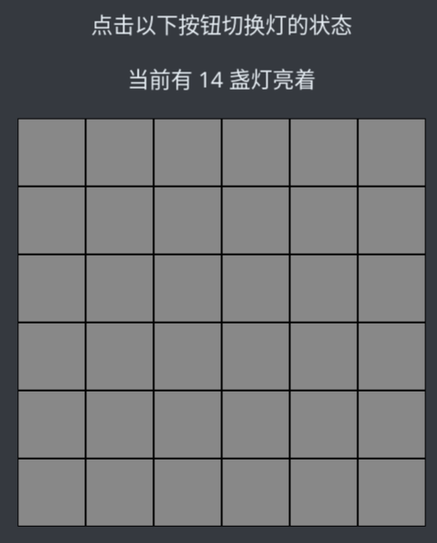
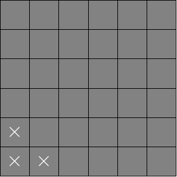
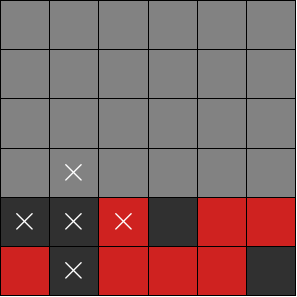

# CountLightsOut

> 本题是 LightsOut 游戏的加强版。
>
> 在一个 6×6 的棋盘中，有些灯是开着的，有些灯是关着的（就像普通的 LightsOut 游戏那样）。
> 
> 但是，你不知道哪些灯是开着的，哪些灯是关着的。每次你进行操作后，我只会告诉你「现在还有几盏灯亮着」。
>
> 你需要把所有灯都灭掉，才能通关。
>
> 

这道题的过法很多，可以通过逻辑推演找试探解，也可以通过理论推导找解析解。从大家的做题效果上来说，如果找试探解的话，只要运气好，几分钟做完也没什么问题。但要找解析解就很麻烦了，光是写代码都得好一段时间。

不过，对于多周目玩家来说，寻找解析解则能一劳永逸地解决问题。找到稳定解法就不用再靠随机应变了，效率更高。

相比于朴素的 LightsOut 游戏而言，这关加强的点在于，玩家并不知道每盏灯的状态，只知道一个“总体情况”。那么如果能通过一定的技巧还原出每盏灯的状态，我们不就可以把它转换成朴素的 LightOut 了吗？至于朴素的 LightsOut 游戏，我们用不着自己解，上网找个 lightsout solver 就可以直接帮我们推导解题方法了。

## 试探解

绝大部分玩家初次做题时都会寻找试探解。一般来说大家有两种不同的策略：

- 一边分析灯的状态，一边灭灯，同步进行。
- 不急于灭灯，先把每盏灯的状态都分析出来。

两种策略都是可行的。在这里我就以第二种策略来介绍。

### 基本思路

首先，如果我们除了初始状态以外一无所知，那么在什么情况下我们可以笃定一盏灯的状态呢？

其实只有一种情况，那就是当点击这盏灯时，亮灯数的变化刚好和此格周围的的灯数相等。

就以下图为例，如果点击了左下角的位置，然后发现亮灯数从 $$n$$ 变成了 $$n+3$$，这说明什么？当然说明原来这三盏灯的状态都是“关”，而当我们点灯之后，三盏灯个状态都变成了“开”。



同样的道理，如果亮灯数从 $$n$$ 变成了 $$n-3$$，那就说明原来三盏灯都是开着的，点灯之后它们都关上了。

但是假如说，我们点灯之后发现 $$n$$ 变成了 $$n+1$$ 或者 $$n-1$$ 的话，那我们就没办法直接下判断了，因为只知道这个范围内“有几盏灯亮着”，却不知道“亮灯的都是哪些”。

假如说我们知道了一部分灯的状态，那么我们就可以据此进一步推导周围灯的状态。以下图为例，红色表示“已知是开着的灯”，黑色表示“已知是关着的灯”，那么当我们点击这个范围时，就可以根据亮灯数的变化，判断那个未知格的状态了。



如果从 $$n$$ 变成了 $$n+3$$，那就说明那个未知格原本是关灯状态；如果从 $$n$$ 变成了 $$n+1$$，那就说明那个未知格原本是开灯状态。

按照这个思路，我们就可以一步步通过已知信息推导出未知信息。

## 解析解

用 $$6\times6$$ 的格子解释起来还是太麻烦了点，我先用 $$3\times2$$ 的情况来作说明吧。

### 第一步


如图所示，我们给每个格子一个布尔值，用 $$1$$ 表示灯开着，$$0$$ 表示灯关着。

而我们又知道，经过一次点击行为后，**亮灯数的变化预示着“受影响范围内有多少盏灯原本是亮着的”**。

举个例子，如果我们点击了左下角的位置，那么 $$b_1,\,b_2,\,b_4$$ 会受到影响，变成它的非值；而亮灯数从 $$n$$ 变成了 $$n-1$$，这就说明在 $$b_1,\,b_2,\,b_4$$ 三盏灯中，有两盏原本是亮着的：

```math
b_1+b_2+b_4=2
```

列出这个式子之后，记得再点一下左下角，恢复原始状态。

接下来我们如法炮制，还可以再点击 $$b_2$$ 所在格，列出如下方程（$$c_n$$ 自行推算）：

```math
b_1+b_2+b_3+b_5=c_2
```

同理，还有四个方程可列：

```math
b_2+b_3+b_6=c_3\\
b_1+b_4+b_5=c_4\\
b_2+b_4+b_5+b_6=c_5\\
b_3+b_5+b_6=c_6
```

这样一来我们就构造了一个六元方程组。方便起见，我们把它写成矩阵形式：

```math
\left[\begin{matrix}1&1&0&1&0&0\\1&1&1&0&1&0\\0&1&1&0&0&1\\1&0&0&1&1&0\\0&1&0&1&1&1\\0&0&1&0&1&1\end{matrix}\right]\times\left[\begin{matrix}b_1\\b_2\\b_3\\b_4\\b_5\\b_6\end{matrix}\right]=\left[\begin{matrix}c_1\\c_2\\c_3\\c_4\\c_5\\c_6\end{matrix}\right]
```

这个方程组的系数行列式等于 $$0$$，意味着方程组不一定有解。但是别担心，“现实”能够保证它是有解的——因为 $$c_k$$ 不是凭空赋值的，它对应的是真实世界中某个可解的情况。

据此，我们就能够通过解方程组把 $$b_k$$ 都解出来了。于是第一步完成。

### 第二步

现在我们知道了每盏灯的状态，接下来我们还需要一个方案来求解“如何灭灯”。

我们知道，两次（以及偶数次）点灯相当于没点，而三次（以及奇数次）点灯相当于只点了一次。所以说对于每盏灯来说，我们要么“点”，要么“不点”，只有这两种选择。

我们设 $$x_k$$ 表示是否需要点第 $k$ 盏灯。以第一盏灯为例，如果 $$b_1$$ 是 $$1$$，那么我们就需要保证**所有影响到该灯的操作之异或和等于 $$1$$**，这样才能关掉该灯；如果 $$b_1$$ 是 $$0$$，那么我们就需要保证**所有影响到该灯的操作之异或和等于 $$0$$**，这样才能不把该灯打开。因此：

```math
x_1\oplus x_2\oplus x_5=b_1
```

其中 $$\oplus$$ 表示异或加，这点与第一步中的操作不同。

同样道理，我们也可以列出剩下的五个式子：

```math
x_1\oplus x_2\oplus x_3\oplus x_5=b_2\\
x_2\oplus x_3\oplus x_6=b_3\\
x_1\oplus x_4\oplus x_5=b_4\\
x_2\oplus x_4\oplus x_5\oplus x_6=b_5\\
x_3\oplus x_5\oplus x_6=b_6\\
```

我们仍然把它写成矩阵形式：

```math
\left[\begin{matrix}1&1&0&1&0&0\\1&1&1&0&1&0\\0&1&1&0&0&1\\1&0&0&1&1&0\\0&1&0&1&1&1\\0&0&1&0&1&1\end{matrix}\right]\times\left[\begin{matrix}x_1\\x_2\\x_3\\x_4\\x_5\\x_6\end{matrix}\right]=\left[\begin{matrix}b_1\\b_2\\b_3\\b_4\\b_5\\b_6\end{matrix}\right]
```

这里的系数矩阵和刚才一模一样，因为系数矩阵正是由这个图的规格决定的。

接下来只要解出全部的 $$x_k$$，我们就知道该点哪些灯了。

### 对 $$3\times2$$ 情形的推广

接下来回到我们的 $$6\times6$$ 关灯游戏，我们会发现，整个问题的框架和 $$3\times2$$ 的版本并没有什么不同。不同的地方只是系数矩阵发生了变化而已。

该矩阵是一个 36 阶方阵，这里不方便写，我就在这里提供一段用于生成此矩阵的 C++ 代码：

```c++
//这里N=M=6
void gaussian::getcoef(bool **coefficient){
	for(int i=0;i<N*M;i++)
		for(int j=0;j<N*M;j++){
			int ix{i/M},iy{i%M},jx{j/M},jy{j%M};
			if(ix==jx){
				int dy{iy-jy};
				if(dy<=1&&dy>=-1)
					coefficient[i][j]=true;
			}
			else if(iy==jy){
				int dx{ix-jx};
				if(dx<=1&&dx>=-1)
					coefficient[i][j]=true;
			}
			else
				coefficient[i][j]=false;
		}
}
```

更多相关代码参见[我的GitHub仓库](https://github.com/cppHusky/2025-puzzle/tree/master/CountLightsOut)。 

### 使用 `z3` 库求解

YouXam 还提供了一个使用 `z3` 库进行求解的方案。相比于自己手写高斯消元，直接调库还是快多了。

```python
from z3 import * # pip install z3-solver
cells = [[BitVec(f"cell_{i + 1}_{j + 1}", 8) for j in range(6)] for i in range(6)]
flips = [[0 for _ in range(6)] for _ in range(6)]
now = int(input('当前有多少个灯亮: '))
print('现在从左到右，从上到下，按顺序点击每个格子，每次点击后，输入有多少个灯亮')
counts = [[int(x) for x in input(f'输入第 {i + 1} 行（空格分割）: ').split()] for i in range(6)]
nowsum = sum([sum(row) for row in cells])
s, k = Solver(), Solver()
s.add(*[Or(cell == 0, cell == 1) for row in cells for cell in row], nowsum == now)
for x in range(6):
    for y in range(6):
        for dx, dy in [(0, 0), (0, 1), (0, -1), (1, 0), (-1, 0)]:
            if 0 <= x + dx < 6 and 0 <= y + dy < 6:
                nowsum += 1 - 2 * (cells[x + dx][y + dy] ^ flips[x + dx][y + dy])
                flips[x + dx][y + dy] ^= 1
        s.add(nowsum == counts[x][y])
s.check()
clicks = [[BitVec(f"click_{i + 1}_{j + 1}", 1) for j in range(6)] for i in range(6)]
k.add(*[0 == (s.model()[cells[x][y]].as_long() ^ flips[x][y])
        + sum([clicks[x + dx][y + dy] for dx, dy in [(0, 0), (0, 1), (0, -1), (1, 0), (-1, 0)]
            if 0 <= x + dx < 6 and 0 <= y + dy < 6]) for x in range(6) for y in range(6)])
k.check()
print('以任意顺序点击值为 1 的灯:\n' + '\n'.join([' '.join([str(k.model()[clicks[x][y]]) for y in range(6)]) for x in range(6)]))
```
