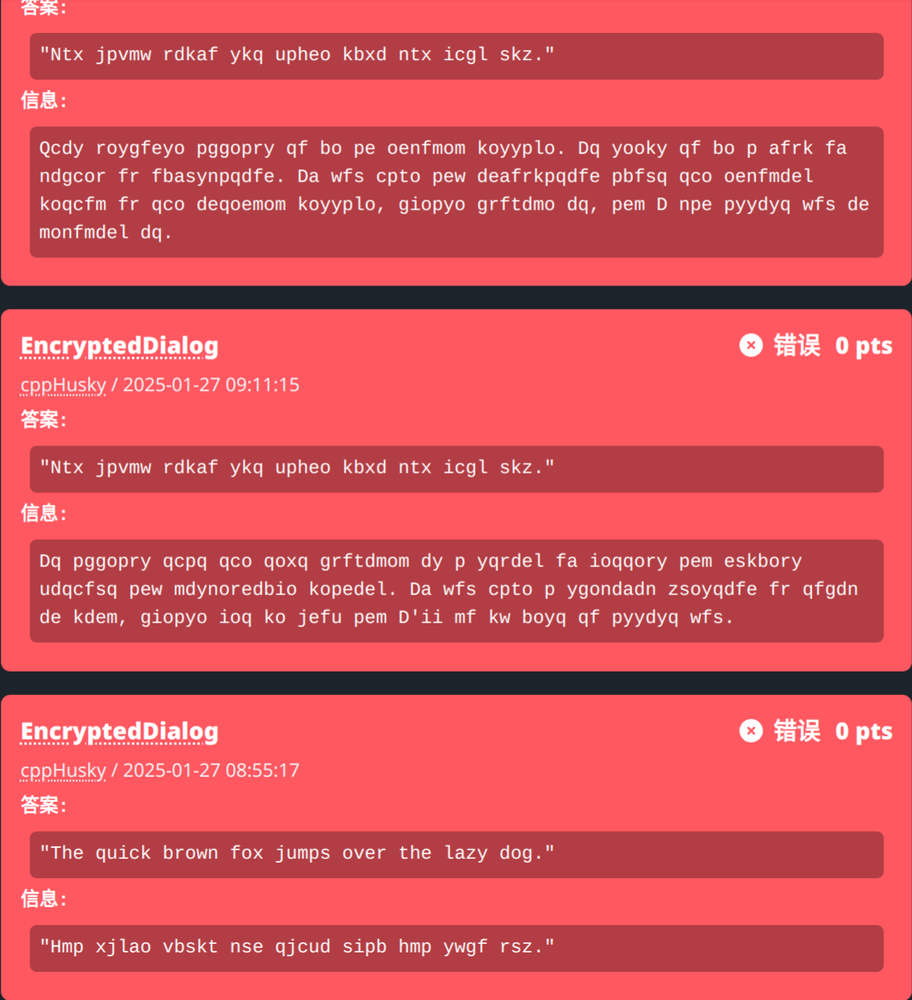
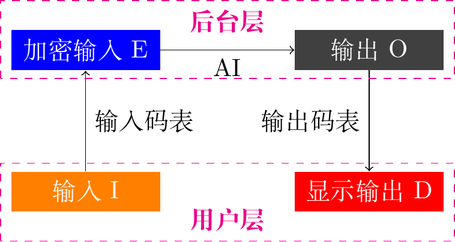
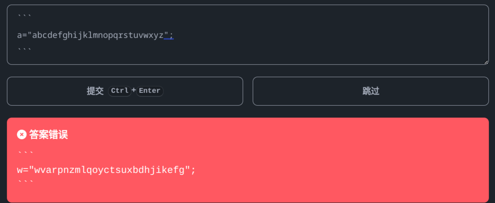
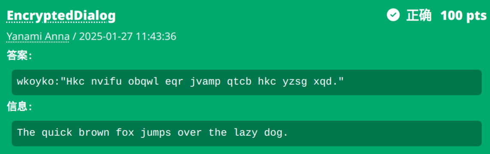

# EncryptedDialog

> 本题是 AI 交互题。你只能用英语来和它交流（更准确地说，只能使用 ASCII 可打印字符，如果 AI 回复了非 ASCII 可打印字符，会使用 □ 来代替）。
>
> 你向 AI 输入的内容将会被一个「输入码表」转换成密文，再发送给 AI 作为输入；AI 的输出又会被一个「输出码表」转换成密文，再显示给你。
> 
> 你事先无从知道这两份码表，我只能告诉你：码表是由26个英文字母到26个英文字母的一一映射（大小写不敏感）。
>
> 你的目标是让 AI 输出一字不差的 `The quick brown fox jumps over the lazy dog.`（注意这里的输出是最终显示到你屏幕上的输出）

## 解析

[视频演示](https://www.bilibili.com/video/BV13vFTeAEzH?spm_id_from=333.788.videopod.episodes&vd_source=03c586261e9a3e1b7d76e7d62b7b0064&p=2)

游戏时发现有人说直接送一个引号套着的字符串就可以让它原模原样输出，我就试了一下。没想到第一次就成了。

但是当我兴冲冲地把码表排好了，准备让他复述的时候，它却再也不复述了。可见这不是稳定解法啊……

### 基本思路

每个回合的流程如下图所示。我们的输入 I 通过输入码表替换成加密输入 E，用于对 AI 的输入；而 AI 的输出 O 又要通过输出码表替换成加密输出 D，显示到我们的屏幕中。

相信大家玩一小会儿就可以慢慢找到 O 和 D 之间的映射关系，我就把它叫做 D2O 吧。有了 D2O，我们至少能理解 AI 每次的输出是什么意思了。

但这样还不足以解决整个问题。如果你希望它原模原样输出你的话（当然，得碰一点运气），那么你至少需要知道 D 和 I 的映射关系 D2I，才能达到目的。而如果你希望给 AI 发指令让他理解你的意思，那你还需要知道 E2I 才行。

### D2O 的测定

D2O 就是一个很简单的单表替换过程，没什么难度可言，随便找个解码网站（比如[quipquip](https://quipquip.com)）都能做了。

如果要自己做的话，可以先把多个回合的 D 整理到一起，做个字频统计，然后就能看出一些常用字母（比如字频 12% 的 e）。接下来再靠语感和不断尝试，把整个替换表解出来就可以了。

### D2I 的测定

D2I 的过程虽然很长，但是对玩家来说，它是最直观的：你知道你自己的输入 I，你也能看到显示的输出 D。可是麻烦点在于，中间的 AI 环节是一个黑箱，我们能否想办法消除这个环节带来的影响呢？当然可以，那就是**引导它进行复述**。

在引导复述时，比较好的方案要么是直接套引号变成引文，要么是直接放代码块要求它解释（它可能会把源代码复述一遍再扯些有的没的），比如说：

这样就很容易把 D2I 统计出来了。

### E2I 的测定
T
如果你还需要测定 E2I 的话，别急，刚才的结果还有用。

我们想，我们已经知道了 D2O，而**在复述过程中，存在 O=E 的部分**，那么我们就可以得到 D2E 吧。

我们刚才又得到了 D2I，那么根据 E2D（D2E 的逆映射）和 D2I，我们就可以求出 E2I 了！

### 指令构造

现在我们掌握了充分的信息，我们可以构造一个指令让 AI 输出我们想要的结果了。

举个例子：`output:"The quick brown fox jumps over the lazy dog."`

这段输入包含“说明”和“内容”的部分。说明部分是 E，要让 AI 能看懂的；而内容部分是 D，要显示到屏幕上的。

所以我们应该用 E2I(`output`) 把说明部分转换成输入，用 D2I(`The quick brown fox jumps over the lazy dog.`) 把内容部分转换成输入。最后，拼成我们要输入的 I。

